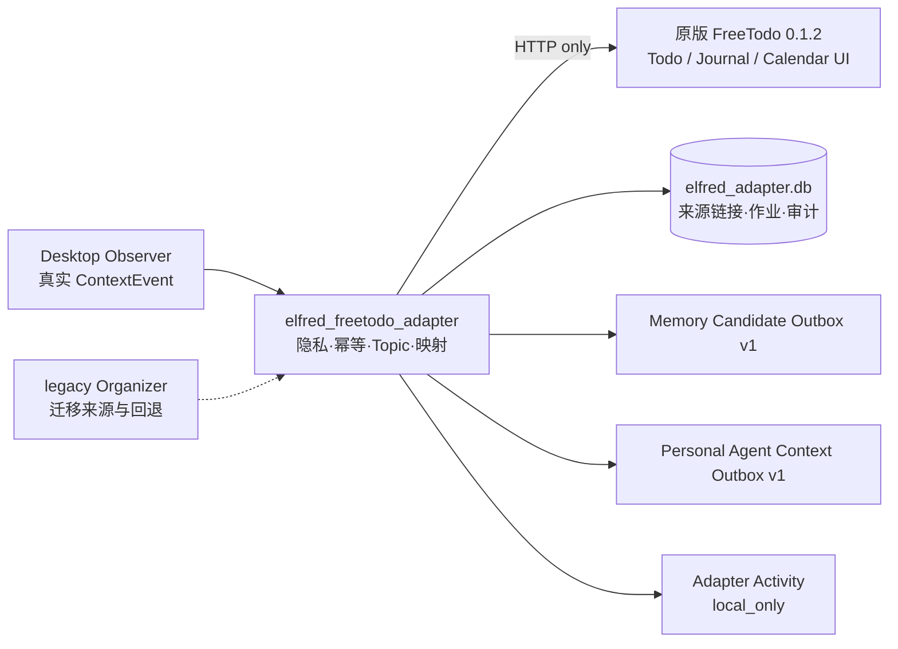

# Elfred × FreeTodo 实际系统链路

Observer 负责采集/OCR/触发/隐私元数据；Adapter 是唯一的组织和同步边界；FreeTodo 只负责成熟 Todo/Journal/Calendar 产品能力；Memory/PA 通过版本化 Outbox 解耦。FreeTodo 自带截图、OCR、录音和 Agent 不进入 Elfred 主链。

用户要求读取的“Elfred 总体技术方案和系统链路图”、两张系统截图以及独立 Memory/PA 正式合同不在 Downloads 或当前工作区中。已完整读取能找到的 `Elfred_Context_Organizer_Codex_任务书与Prompt.md`、Observer/legacy 的架构与接口文档，并以上述真实代码合同补足演示链路；缺失材料不会被伪装成已审计。
